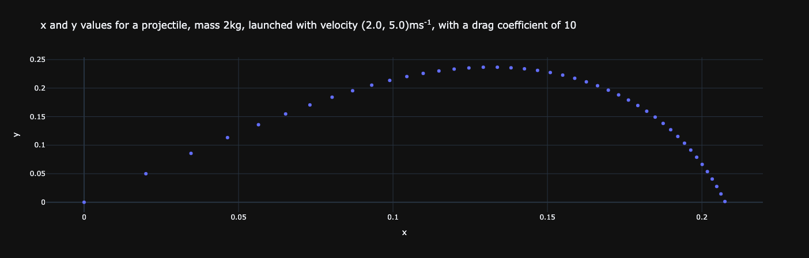
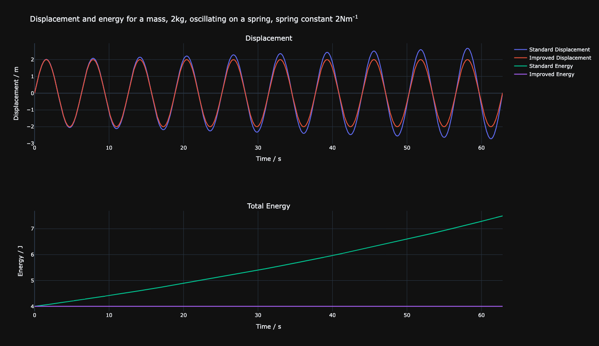
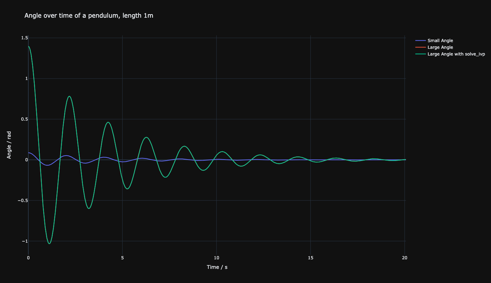

# Computational Physics Simulations

This is a collection of physics simulations built to help me learn and understand the use of numerical methods and solvers and their implementation in Python. 

The simulations progress from using custom Euler's method functions to scipy's ivp solver and RK45 solver.

## Setup
```bash
python3 -m venv .venv
source .venv/bin/activate
pip install -r requirements.txt
```

## Running
Each simulation is a self-contained Jupyter notebook. Open in VS Code or Jupyter and run all cells. Live animations use `%matplotlib widget` and run indefinitely until closed.

## Simulations

### 1. Projectile Motion Simulation
- uses Euler's method to estimate the motion of a projectile falling under gravity with the inclusion of air resistance
- generates a scatter plot of the y-position against the x-position



### 2. Mass-Spring Simulation
- compares Euler's method and Euler's improved method to model a mass oscillating on a spring
- generates a plot of displacement and total energy in the system for both methods
- outputs a video of the motion of the mass on the spring, created using [manim](https://github.com/ManimCommunity/manim)


<<<<<<< HEAD
https://raw.githubusercontent.com/leomacherla/computational-physics-simulations/refs/heads/main/assets/mass_spring_2.mp4
=======
https://github.com/leomacherla/computational-physics-simulations/raw/refs/heads/main/assets/mass_spring_2.mp4
>>>>>>> 3e66fec (Use absolute URLs for README videos)

### 3. Single-Pendulum Simulation
- compares Euler's improved method and scipy's ivp solver to model a single pendulum with damping
- generates a plot of angular displacement over time for small and large initial angular displacement
- outputs a video of the motion of the pendulum, created using [manim](https://github.com/ManimCommunity/manim)


<<<<<<< HEAD
https://raw.githubusercontent.com/leomacherla/computational-physics-simulations/refs/heads/main/assets/single_pendulum_2.mp4

=======
https://github.com/leomacherla/computational-physics-simulations/raw/refs/heads/main/assets/single_pendulum_2.mp4
>>>>>>> 3e66fec (Use absolute URLs for README videos)

### 4. Double-Pendulum Simulation
- simulates n double-pendulums, initially displaced 0.0001 degrees apart, using scipy's RK45 solver
- generates a live playback of the motion the double pendulums using matplotlib

<<<<<<< HEAD
https://raw.githubusercontent.com/leomacherla/computational-physics-simulations/refs/heads/main/assets/double_pendulum.mp4
=======
https://github.com/leomacherla/computational-physics-simulations/raw/refs/heads/main/assets/double_pendulum.mp4
>>>>>>> 3e66fec (Use absolute URLs for README videos)

### 5. Lorenz Attractor Simulation
- simulates a lorenz attractor using scipy's RK45 solver using the classic parameters σ=10, ρ=28, β=8/3
- generates a live playback of the motion of the attractor using matplotlib

<<<<<<< HEAD
https://raw.githubusercontent.com/leomacherla/computational-physics-simulations/refs/heads/main/assets/lorenz_attractor.mp4
=======
https://github.com/leomacherla/computational-physics-simulations/raw/refs/heads/main/assets/lorenz_attractor.mp4
>>>>>>> 3e66fec (Use absolute URLs for README videos)

### 6. Two-Body Orbit Simulation
- simulates the orbital motion of two bodies using scipy's RK45 solver and initial conditions similar to those of the Earth-Sun system
- generates a live playback of the motion of the twπo bodies using matplotlib

<<<<<<< HEAD
https://raw.githubusercontent.com/leomacherla/computational-physics-simulations/refs/heads/main/assets/two_body.mp4
=======
https://github.com/leomacherla/computational-physics-simulations/raw/refs/heads/main/assets/two_body.mp4
>>>>>>> 3e66fec (Use absolute URLs for README videos)

### 7. Three-Body Orbit Simulation
- simulates the orbital motion of three bodies using scipy's RK45 solver
- includes the default initial conditions which reproduce the figure-8 periodic orbit discovered by Cris Moore in 1993 (see [Richard Montgomery's N-body page](https://people.ucsc.edu/~rmont/Nbdy.html))
- generates a live playback of the motion of the three bodies using matplotlib

<<<<<<< HEAD
https://raw.githubusercontent.com/leomacherla/computational-physics-simulations/refs/heads/main/assets/three_body.mp4
=======
https://github.com/leomacherla/computational-physics-simulations/raw/refs/heads/main/assets/three_body.mp4
>>>>>>> 3e66fec (Use absolute URLs for README videos)
